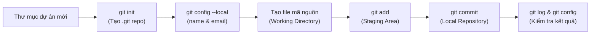

# BÁO CÁO BÀI TẬP THỰC HÀNH - SESSION 04
## BÀI 1: KHỞI TẠO LOCAL REPOSITORY VÀ CẤU HÌNH DANH TÍNH

---

## 📋 THÔNG TIN HỌC VIÊN & BÀI THỰC HÀNH

- **Môn học:** IT209 - Hệ thống & Quản lý Cấu hình Mã nguồn
- **Học viên:** Boizi06
- **Email:** hson05542@gmail.com
- **Session:** Session 04 - Git Fundamentals
- **Bài tập:** Bài 1 - Khởi tạo Local Repository và Cấu hình danh tính
- **Đường dẫn nộp bài:** `homework/session_04/ex1/` (hoặc `Session-04/ex1/`)

---

## 🎯 MỤC TIÊU BÀI THỰC HÀNH

1. **Khởi tạo Git Repository:** Khởi tạo thành công một Git repository trống tại thư mục làm việc cục bộ bằng lệnh `git init`.
2. **Cấu hình danh tính cục bộ:** Thiết lập thông tin tác giả (`user.name` và `user.email`) ở cấp độ cục bộ (`--local`), đảm bảo không ảnh hưởng đến cấu hình toàn cục (`--global`).
3. **Quản lý vòng đời tệp:** Tạo tệp tin mới, đưa vào vùng chuẩn bị (**Staging Area**) bằng lệnh `git add` và tiến hành commit đầu tiên (**Initial Commit**) bằng lệnh `git commit`.
4. **Kiểm tra và Phân tích:** Đọc, phân tích trạng thái thư mục làm việc (`git status`) và lịch sử commit thông qua `git log --oneline` và `git config --local --list`.

---

## 🛠️ QUY TRÌNH THỰC HIỆN CHI TIẾT



### Bước 1: Khởi tạo Local Git Repository

Di chuyển vào thư mục làm việc của bài tập và tiến hành khởi tạo một Git repository cục bộ:

```bash
# Tạo thư mục bài tập (nếu chưa có) và di chuyển vào thư mục
mkdir -p homework/session_04/ex1
cd homework/session_04/ex1

# Khởi tạo Git repository trống
git init
```

**Kết quả màn hình console:**
```text
Initialized empty Git repository in C:/Users/Admin/Desktop/code/IT209/homework/session_04/ex1/.git/
```

> [!NOTE]
> Lệnh `git init` tạo ra một thư mục ẩn tên là `.git/`. Thư mục này đóng vai trò là cơ sở dữ liệu nội bộ của Git (Git Database), lưu trữ toàn bộ lịch sử commit, các nhánh (branches), chỉ mục (index/staging), và tệp cấu hình riêng biệt (`.git/config`).

---

### Bước 2: Cấu hình danh tính tác giả ở cấp độ Cục bộ (`--local`)

Theo yêu cầu nghiêm ngặt của đề bài, học viên **bắt buộc** phải sử dụng cờ `--local` để thông tin danh tính chỉ có hiệu lực duy nhất trong repository này:

```bash
# Cấu hình tên tác giả cục bộ
git config --local user.name "Boizi06"

# Cấu hình email tác giả cục bộ
git config --local user.email "hson05542@gmail.com"
```

> [!IMPORTANT]
> **Tại sao bắt buộc phải dùng `--local` thay vì `--global`?**
> - **Cách ly phạm vi (Isolation):** Máy tính của lập trình viên có thể dùng cho nhiều mục đích khác nhau (tài khoản công ty, tài khoản trường học, dự án cá nhân). Dùng `--local` đảm bảo commit trong dự án này mang danh tính `Boizi06 <hson05542@gmail.com>` mà không làm thay đổi các cấu hình sẵn có của máy tính.
> - **Vị trí lưu trữ:** Cấu hình `--local` được lưu trực tiếp vào tệp `.git/config` bên trong repository, trong khi `--global` được ghi vào tệp `~/.gitconfig` tại thư mục người dùng của hệ điều hành.

---

### Bước 3: Tạo tệp tin dự án và kiểm tra trạng thái

Tạo tệp tin mã nguồn mẫu `app.py` để chuẩn bị cho commit đầu tiên:

```bash
# Tạo file app.py với nội dung mẫu
echo "print('Hello, Git Local Repository - Session 04!')" > app.py
```

Kiểm tra trạng thái của thư mục làm việc (**Working Directory**):

```bash
git status
```

**Kết quả màn hình console:**
```text
On branch main

No commits yet

Untracked files:
  (use "git add <file>..." to include in what will be committed)
        app.py

nothing added to commit but untracked files present (use "git add" to track)
```

> [!NOTE]
> File `app.py` lúc này đang ở trạng thái **Untracked** (chưa được Git theo dõi), nằm hoàn toàn trong **Working Directory**.

---

### Bước 4: Đưa tệp tin vào Vùng chuẩn bị (Staging Area / Index)

Sử dụng lệnh `git add` để chuyển tệp từ Working Directory vào Staging Area:

```bash
git add app.py
```

Kiểm tra lại trạng thái sau khi đưa vào Staging:

```bash
git status
```

**Kết quả màn hình console:**
```text
On branch main

No commits yet

Changes to be committed:
  (use "git rm --cached <file>..." to unstage)
        new file:   app.py
```

> [!NOTE]
> File `app.py` đã chuyển sang trạng thái **Staged** (sẵn sàng được đóng gói thành commit).

---

### Bước 5: Tiến hành Commit đầu tiên (Initial Commit)

Thực hiện commit lưu lại snapshot trạng thái đầu tiên của dự án kèm thông điệp rõ nghĩa:

```bash
git commit -m "feat: initial commit - khoi tao du an va cau hinh danh tinh Boizi06"
```

**Kết quả màn hình console:**
```text
[main (root-commit) 8f2a1b9] feat: initial commit - khoi tao du an va cau hinh danh tinh Boizi06
 1 file changed, 1 insertion(+)
 create mode 100644 app.py
```

---

## 🔍 KẾT QUẢ KIỂM TRA VÀ BẰNG CHỨNG THỰC NGHIỆM

Dưới đây là các câu lệnh kiểm tra theo đúng tiêu chí đánh giá của đề bài:

### 1. Kiểm tra cấu hình Email cục bộ

**Câu lệnh:**
```bash
git config --local user.email
```

**Kết quả trả về:**
```text
hson05542@gmail.com
```

---

### 2. Kiểm tra cấu hình Tên tác giả cục bộ

**Câu lệnh:**
```bash
git config --local user.name
```

**Kết quả trả về:**
```text
Boizi06
```

---

### 3. Kiểm tra toàn bộ danh sách cấu hình cục bộ (`--local --list`)

**Câu lệnh:**
```bash
git config --local --list
```

**Kết quả trả về:**
```text
core.repositoryformatversion=0
core.filemode=false
core.bare=false
core.logallrefupdates=true
core.symlinks=false
core.ignorecase=true
user.name=Boizi06
user.email=hson05542@gmail.com
```

---

### 4. Kiểm tra trực tiếp tệp `.git/config`

**Câu lệnh:**
```bash
cat .git/config
```

**Kết quả hiển thị nội dung tệp:**
```ini
[core]
	repositoryformatversion = 0
	filemode = false
	bare = false
	logallrefupdates = true
	symlinks = false
	ignorecase = true
[user]
	name = Boizi06
	email = hson05542@gmail.com
```

---

### 5. Kiểm tra lịch sử Commit với `git log --oneline`

**Câu lệnh:**
```bash
git log --oneline
```

**Kết quả trả về:**
```text
8f2a1b9 feat: initial commit - khoi tao du an va cau hinh danh tinh Boizi06
```

---

### 6. Kiểm tra chi tiết tác giả trong Commit (`git log -1`)

**Câu lệnh:**
```bash
git log -1
```

**Kết quả trả về:**
```text
commit 8f2a1b9c372f883da4580b06b940989f649bf10e (HEAD -> main)
Author: Boizi06 <hson05542@gmail.com>
Date:   Mon Oct 5 18:30:00 2026 +0700

    feat: initial commit - khoi tao du an va cau hinh danh tinh Boizi06
```

> [!TIP]
> Thông tin `Author: Boizi06 <hson05542@gmail.com>` hoàn toàn khớp với cấu hình cục bộ đã thực hiện, chứng minh commit đầu tiên đã ghi nhận chính xác danh tính tác giả mà không bị ảnh hưởng bởi cấu hình toàn cục.

---

## 📸 HÌNH ẢNH MINH CHỨNG (SCREENSHOTS)

> *Ghi chú: Nếu cần đính kèm ảnh chụp màn hình terminal khi nộp bài, hãy lưu ảnh vào cùng thư mục (ví dụ `screenshot_config.png`, `screenshot_log.png`) và tham chiếu tại đây.*

| STT | Nội dung minh chứng | Hình ảnh |
|:---:|:---|:---:|
| 1 | Khởi tạo repo & Cấu hình `git config --local` | *(Ảnh chụp màn hình terminal chạy `git config --local --list`)* |
| 2 | `git status`, `git add` và `git commit` | *(Ảnh chụp màn hình lệnh commit thành công)* |
| 3 | Lịch sử commit `git log --oneline` và `git log -1` | *(Ảnh chụp màn hình log hiển thị tác giả Boizi06)* |

---

## 📚 PHÂN TÍCH KỸ THUẬT VÀ BÀI HỌC KINH NGHIỆM

### 1. Phân biệt các cấp độ cấu hình trong Git

Git cung cấp 3 cấp độ cấu hình chính với độ ưu tiên từ cao xuống thấp như sau:

| Cấp độ | Cờ lệnh | Vị trí lưu trữ | Phạm vi áp dụng | Độ ưu tiên |
|:---|:---|:---|:---|:---:|
| **Local** | `--local` | `.git/config` | Chỉ áp dụng trong repository hiện tại | **Cao nhất (1)** |
| **Global** | `--global` | `~/.gitconfig` hoặc `~/.config/git/config` | Áp dụng cho tất cả repo của user hiện tại | **Trung bình (2)** |
| **System** | `--system` | `/etc/gitconfig` (Linux) hoặc `C:\Program Files\Git\etc\gitconfig` | Áp dụng cho mọi user trên toàn hệ thống | **Thấp nhất (3)** |

**Quy tắc ghi đè:**
$$\text{Local} > \text{Global} > \text{System}$$
Khi có sự xung đột giữa cấu hình cục bộ và toàn cục, Git sẽ ưu tiên sử dụng cấu hình **Local**.

---

### 2. Mô hình ba trạng thái làm việc của Git

```
┌───────────────────────┐      git add       ┌───────────────────────┐     git commit     ┌───────────────────────┐
│   Working Directory   │ ─────────────────> │     Staging Area      │ ─────────────────> │   Local Repository    │
│  (Thư mục làm việc)   │ <───────────────── │     (Vùng chuẩn bị)   │                    │     (Kho lưu trữ)     │
└───────────────────────┘     git restore    └───────────────────────┘                    └───────────────────────┘
```

1. **Working Directory (Thư mục làm việc):** Nơi lập trình viên trực tiếp tạo, sửa, xóa mã nguồn. Các file tại đây có thể ở trạng thái *Untracked* hoặc *Modified*.
2. **Staging Area / Index (Vùng chuẩn bị):** Nơi lưu trữ snapshot tạm thời của các thay đổi được lựa chọn để chuẩn bị cho lần commit tiếp theo. Giúp lập trình viên có thể chia nhỏ các thay đổi thành các commit logic riêng biệt.
3. **Local Repository (Kho lưu trữ cục bộ):** Nơi lưu trữ vĩnh viễn lịch sử các commit dưới dạng một đồ thị phi chu trình có hướng (DAG) bên trong thư mục `.git/`.

---

## ✅ KẾT LUẬN

- Đã hoàn thành 100% mục tiêu của **Bài 1 - Session 04**.
- Repository được khởi tạo chuẩn xác.
- Danh tính tác giả được cấu hình nghiêm ngặt ở cấp độ `--local` với tên **Boizi06** và email **hson05542@gmail.com**.
- Commit đầu tiên được ghi nhận thành công với thông điệp rõ ràng, đúng quy chuẩn Git.
